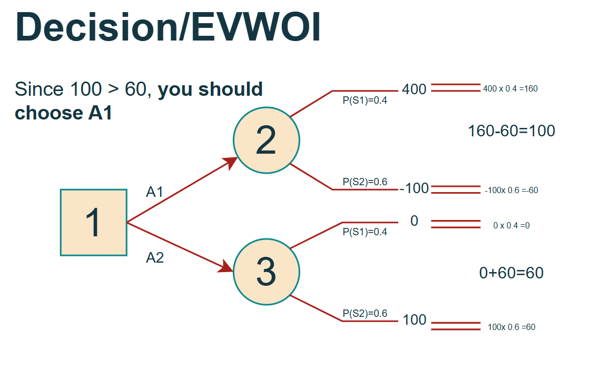
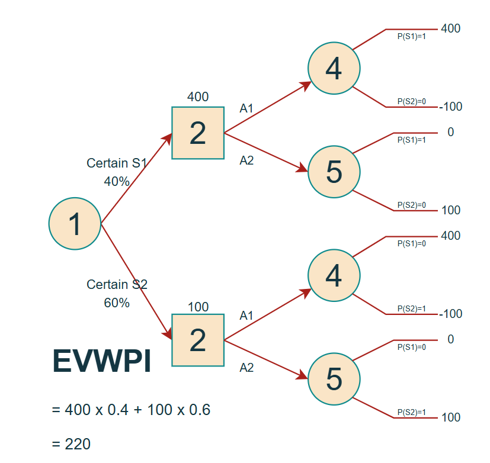
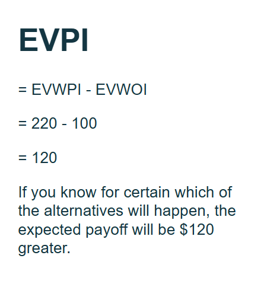
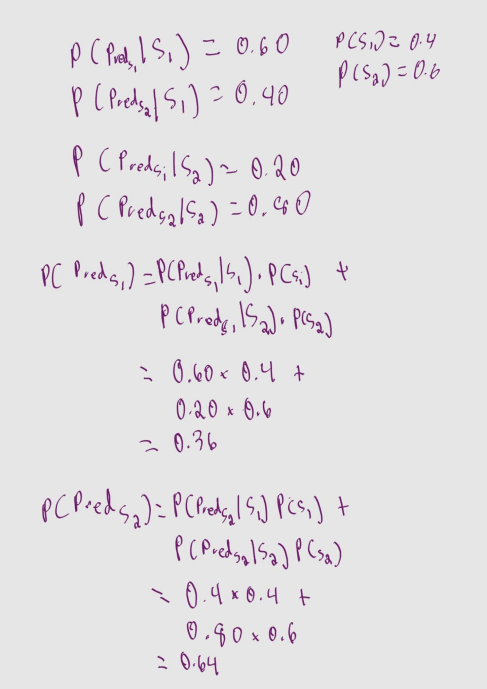
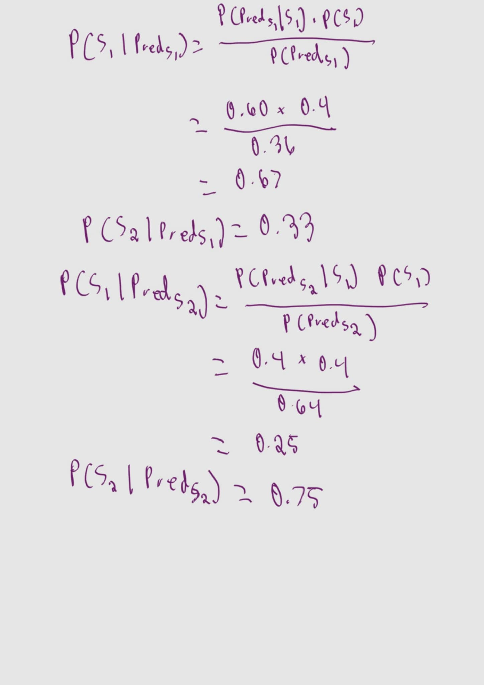

# Decision Analysis Problem: Step-by-Step Solution

**Given Information:**
Payoff Table (in dollars):
| Alternative | State S1 | State S2 |
|-------------|----------|----------|
| A1          | 400      | -100     |
| A2          | 0        | 100      |

Prior Probabilities:

$P(S_1) = 0.4$

$P(S_2) = 0.6$

---

### (a) Given that the research is not done, use Bayes' decision rule to determine which decision alternative should be chosen.

---

### (b) Find EVPI. Does this answer indicate that it might be worthwhile to do the research?

Yes the $120 difference makes it worthwhile to at least check out the cost and effectiveness of research since it's more than double the amount of the optimal solution without any reseach.

---
### (c) Given that the research is done, find the joint probability of each of the following pairs of outcomes:
### (d) Find the unconditional probability that the research predicts S1. Also find the unconditional probability that the research predicts S2.
### (e) Given that the research is done, use your answers in parts (c) and (d) to determine the posterior probabilities of the states of nature for each of the two possible predictions of the research.

$\text{Research Cost:} \ \$100$

Let 

$Pred_{S_1} = \text{Research predicts} \ S_1$, 

$Pred_{S_2} = \text{Research predicts} \ S_2$.

### (f) Given that the research predicts S1, use Bayes' decision rule to determine which decision alternative should be chosen and the resulting expected payoff.
### (g) Repeat part (f) when the research predicts S2.
### (h) Given that research is done, what is the expected payoff when using Bayes' decision rule?
### (i) Use the preceding results to determine the optimal policy regarding whether to do the research and the choice of the decision alternative.

---
# 2nd Item
Midtown Bank always has two tellers on duty. Customers arrive to receive service from a teller at a mean rate of 40 per hour. A teller requires an average of 2 minutes to serve a customer. When both tellers are busy, an arriving customer joins a single line to wait for service. Experience has shown that customers wait in line an average of 1 minute before service begins.
## (a) Describe why this is a queueing system.
This scenario is a queueing system because:
* When customers arrive, they are asked to get behind the line before they could receive the business' service. 
* An arrival rate was given with 40 customers per hour.
* There are servers waiting in front of the line (two of them) who will provide the service once a person gets in front.

In other words, since the business can't serve all customers at the same time and have to wait in line to be served, this system is queueing.

## (b) Determine the basic measures of performance—Wq, W, Lq, and L—for this queueing system

Given:

* $\lambda = \frac{40}{hr} \cdot \frac{hr}{60 \ min} = \frac{2}{3 \ min}$
* $\mu = \frac{1}{2 \ min}$
* $W_q = 1 \ min $
* $c = 2$

### $W$  (Average time a customer spends in the system)

$$W = W_q + \frac{1}{\mu}$$
$$W = 1 \ min + \frac{1}{\frac{1}{2 \ min}} = 3 \ min$$

### $L_q$  (Average number of customers in the queue):
By Little's Law, $L_q = \lambda \cdot W_q$

$$L_q = \frac{2}{3 \ min} \cdot 1 \ min = 2/3$$

### $L$ (Average number of customers in the system):
By Little's Law, $L = \lambda \cdot W$

$$L = \frac{2}{3 \ min} \cdot 3 \ min = 2$$

